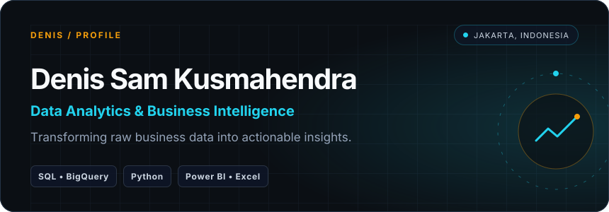

  
  
  

## 👨‍💼 About Me

👋 Hello, my name is Denis Sam Kusmahendra (18). I'm currently a Statistics undergraduate at Jakarta State University with a strong interest in e-commerce, retail, and data-driven business strategy.
	
🗂️ Over the past several months, I've built end-to-end analytics projects using SQL, Python, Power BI, and BigQuery, focusing on sales performance, customer behavior, marketing funnel optimization, and inventory forecasting. Through these projects, I've learned how to translate data into actionable insights that support better business decisions.

## 🛠 Toolbox

## 📌 Selected Work

| Project | What it demonstrates | Stack |
|---------|----------------------|-------|
| **[Sales Performance & Business Dashboard](https://github.com/denissamkusmahendra/Sales-Performance-Analysis)** | Interactive Power BI dashboard analyzing sales KPIs, revenue trends, and regional performance using the Olist e-commerce dataset. | `PostgreSQL` `Power BI` |
| **[Customer Retention & Segmentation Analysis](https://github.com/denissamkusmahendra/Customer-Retention-and-Segmentation-Analysis)** | Applied RFM segmentation and Cohort Analysis to identify high-value customers and evaluate customer retention over time. | `Python` `PostgreSQL` `Power BI` |
| **[Marketing Performance & Funnel Analytics](https://github.com/denissamkusmahendra/Marketing-and-Conversion-Funnel-Analysis)** | Analyzed GA4 event data in BigQuery to identify checkout funnel drop-offs, conversion rates, and marketing performance. | `BigQuery` `SQL` `Power BI` |
| **[Demand Forecasting & Inventory Optimization](https://github.com/denissamkusmahendra/Demand-Forecasting-and-Inventory-Optimization-Analysis)** | Built Holt-Winters forecasting models and an ABC-XYZ inventory matrix to support inventory planning and replenishment decisions. | `PostgreSQL` `Python` `Power BI` |

**Now:** Building new analytics projects and continuously improving my SQL, Python, Power BI, and Google BigQuery skills while exploring Business Intelligence and Operations Analytics.
<!--
**denissamkusmahendra/denissamkusmahendra** is a ✨ _special_ ✨ repository because its `README.md` (this file) appears on your GitHub profile.

Here are some ideas to get you started:

- 🔭 I’m currently working on ...
- 🌱 I’m currently learning ...
- 👯 I’m looking to collaborate on ...
- 🤔 I’m looking for help with ...
- 💬 Ask me about ...
- 📫 How to reach me: ...
- 😄 Pronouns: ...
- ⚡ Fun fact: ...
-->
